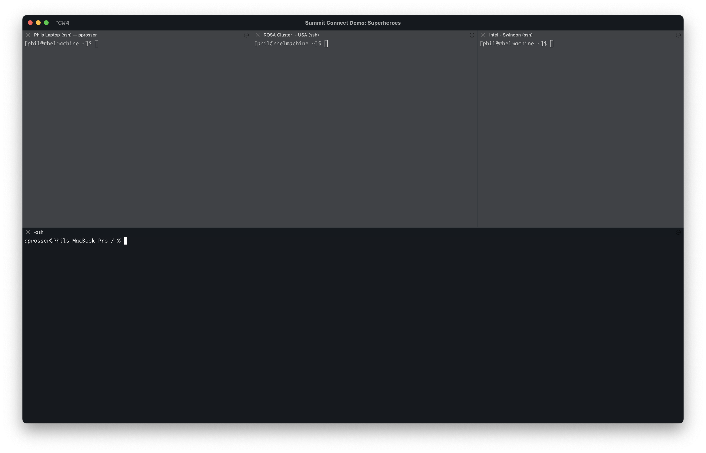

# Superheroes and Skupper demo

## Introduction

The purpose of this demo is to show how easy it is to setup Skupper. I choose to use the Superheroes demo because its microservice architecure. It makes it very to use Skupper with.

The demo uses 2 OpenShift clusters, really doesn't matter which or where you deploy them. Clearly, the bigger the seperation, the more effective the demo is. I also use a local database running on my laptop.

Here is an architecture diagram of the application:


Here is how the distribution will be set up:

I have chosen to split the villain service out on to a seperate cluster using Skupper and exposing the service. 

For the Heroes service.... I have hosted a mysql DB on my laptop that containes a table with the data in.

The demo will use a Skupper Gateway to expose the mysql DB to the Skupper Virutal application network.

Having exposed the database, Debezium is used to replicated the database, and then replicate changes to Kafka (either running on the OpenShift cluster, or usinf RHOSAK).

A small Camel K Integration will read the messages from Kafka and route them to the Postgres DB, allowing the full application to work.

## Setting up the Demo

### Deploy 2 OpenShift clusters

Choose one of the 2 clusters to host the Superheroes fight game. Typically choose the most public cluster if you have one.

I'm normally using AWS hosted and demolab

### Deploy the demo

Clone this repo so you can run the commands locally

#### Create the superheroes namespace in the public cluster

```
oc new-project superheroes
```

#### Deploy the application into the superheroes namespace

* clone the repository

  ```
  git clone https://github.com/pprosser-redhat/quarkus-super-heroes.git
  ```

* deploy the whole application into the superheroes namespace

   cd to the root of the cloned project

   ```
   oc apply -f deploy/k8s/native-java17-kubernetes.yml
   ```

   remove the villain service so it can be deployed in the other cluster

   ```
   oc delete all -l app.kubernetes.io/part-of=villains-service
   ```

* deploy the villain service to the 2nd OpenShift cluster

  oc to the second cluster

  create a new namespace 

  ```
  oc new-project villains
  ```

  deploy the villain service

  ```
  oc apply -f rest-villains/deploy/k8s/native-java17-kubernetes.yml
  ```

  Demo code should all now be deployed

# Demo Instructions

## Get the fight app up (URL will be different of course)

```
http://ui-super-heroes-superheroes.apps.rosa-zjs4n.tvaf.p1.openshiftapps.com/
```

## Clear demo Heroes

Make sure the hero data is deleted from the hero pod on rosa\

```
psql --dbname=heroes_database --username=superman --password
```
```
delete from hero;
```

## Initialise Skupper in each namespace

```
skupper init --site-name rosa --console-auth openshift
```
```
skupper init --site-name intel --console-auth openshift
```

## Link the sites together (most private to the most public)

Can do this in the consoles as well if you want 

In rosa window
```
skupper token create ~/rosa.yaml -t cert --name rosa
```
In intel window
```
skupper link create ~/rosa.yaml
```

## Expose  the villain service on the intel side

```
skupper expose deployment rest-villains --port 8084 --protocol http
```
Check the game, villains should start appearing.... might need to refresh the page.

## Get data from my laptop by defining a skupper gateway on the rosa node

```
skupper gateway init --type podman
```

## Expose my database

```
skupper gateway expose philsmysql 10.0.2.2 3306 --protocol tcp --type podman
```

Test that I can connect to to DB, in a mysql pod on either cluster

```
mysql --host=philsmysql --port 3306 --user=phil --password=phil
```
```
select id, name, othername from phil.hero;
```

## Setup debezium to capture data

### Kafka Cluster:
```
apiVersion: kafka.strimzi.io/v1beta2
kind: Kafka
metadata:
  name: my-cluster
spec:
  entityOperator:
    topicOperator: {}
    userOperator: {}
  kafka:
    config:
      offsets.topic.replication.factor: 1
      transaction.state.log.replication.factor: 1
      transaction.state.log.min.isr: 1
      default.replication.factor: 1
      min.insync.replicas: 1
      inter.broker.protocol.version: '3.2'
      delete.topic.enabled: true
    listeners:
      - name: plain
        port: 9092
        tls: false
        type: internal
      - name: tls
        port: 9093
        tls: true
        type: internal
    replicas: 1
    storage:
      type: persistent-claim
      size: 1Gi
      deleteClaim: true
    version: 3.2.3
  zookeeper:
    replicas: 1
    storage:
      type: persistent-claim
      size: 1Gi
      deleteClaim: true

```
### Kafka Connect Cluster


Note: Make sure you create the imagestream. The build will just wait if you don't


```
apiVersion: kafka.strimzi.io/v1beta2
kind: KafkaConnect
metadata:
  name: my-connect-cluster
  annotations:
    strimzi.io/use-connector-resources: "true"
spec:
  bootstrapServers: 'my-cluster-kafka-bootstrap:9093'
  replicas: 1
  config:
    group.id: connect-cluster
    offset.storage.topic: connect-cluster-offsets
    config.storage.topic: connect-cluster-configs
    status.storage.topic: connect-cluster-status
    config.storage.replication.factor: 1
    offset.storage.replication.factor: 1
    status.storage.replication.factor: 1
  tls:
    trustedCertificates:
      - certificate: ca.crt
        secretName: my-cluster-cluster-ca-cert
  version: 3.2.3
  build:
    output:
      type: imagestream
      image: debezium-connector-image:latest
    plugins:
      - name: debezium-mysql-connector
        artifacts:
          - type: zip
            url: https://maven.repository.redhat.com/ga/io/debezium/debezium-connector-mysql/1.9.5.Final-redhat-00001/debezium-connector-mysql-1.9.5.Final-redhat-00001-plugin.zip 
      - name: debezium-postgres-connector
        artifacts:
          - type: zip
            url: https://maven.repository.redhat.com/ga/io/debezium/debezium-connector-postgres/1.9.5.Final-redhat-00001/debezium-connector-postgres-1.9.5.Final-redhat-00001-plugin.zip
```
## Deploy the Kafka Connector

```
apiVersion: kafka.strimzi.io/v1beta2
kind: KafkaConnector
metadata:
  name: phils-connector  
  labels:
    strimzi.io/cluster: my-connect-cluster
spec:
  class: io.debezium.connector.mysql.MySqlConnector
  tasksMax: 1  
  config:
    snapshot.mode: when_needed
    database.hostname: philsmysql  
    database.port: 3306
    database.user: phil
    database.password: phil
    database.server.id: 18999  
    database.server.name: philsmac  
    database.whitelist: phil
    database.history.kafka.bootstrap.servers: my-cluster-kafka-bootstrap:9092  
    database.history.kafka.topic: schema-changes.phil
```

## Deploy the integration to replicate the data

```
kamel run camelkfordebezium/crudlegacyheroes.yaml
```

## To monitor the Kafka Topic

```
oc exec -it my-cluster-kafka-0 -- /opt/kafka/bin/kafka-console-consumer.sh \
  --bootstrap-server localhost:9092 \
  --from-beginning \
  --topic philsmac.phil.hero
```

## Terminal window. 

Create a termin window like this:



I have created an arrangement on my laptop to speed this up.